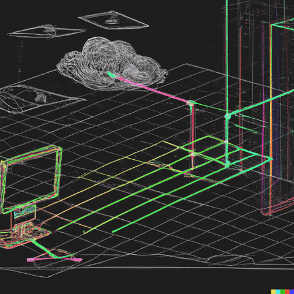

## Hi, I'm Kuro0000 👋

<table>
  <tr>
    <td valign="top" width="60%">
      <h3>🎓 About Me</h3>
      <ul>
        <li><strong>Computer Engineering Student</strong> at <strong>Alma Mater Studiorum - Università di Bologna (UNIBO)</strong>.</li>
        <li>Deeply interested in low-level systems programming, networking architecture, and software optimization.</li>
      </ul>
    </td>
    <td valign="top" width="40%" align="center">
      
    </td>
  </tr>
</table>

# 💻 Tech Stack:
         
    
# 📊 GitHub Stats:
 

<!-- Proudly created with GPRM ( https://gprm.itsvg.in ) -->

<!-- Proudly created with GPRM ( https://gprm.itsvg.in ) -->
